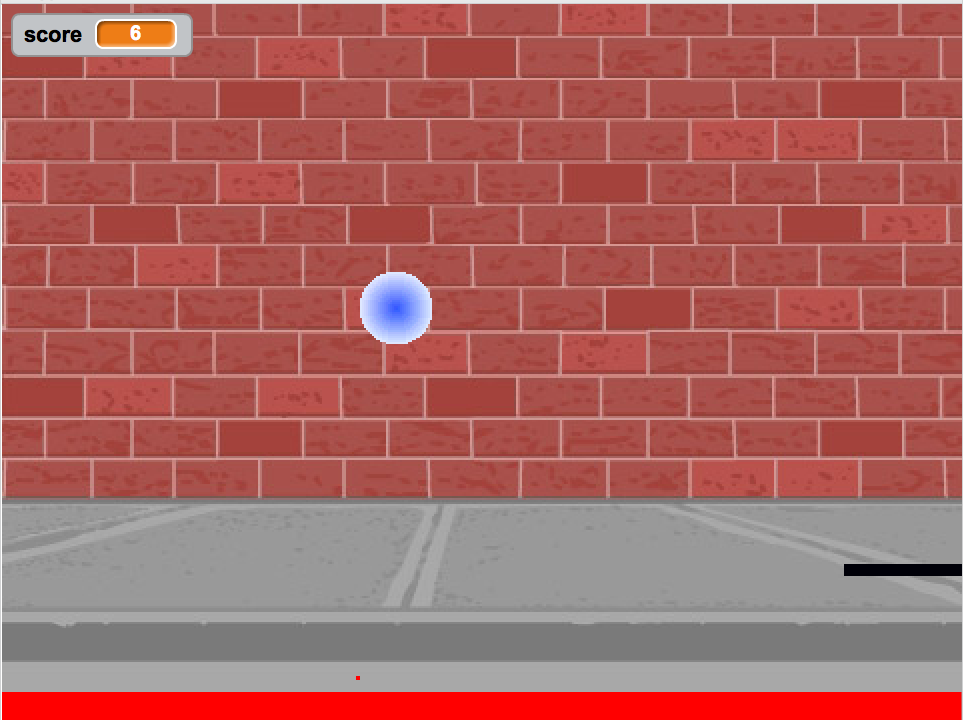

..  Copyright (C)  Mark Guzdial, Barbara Ericson, Briana Morrison
    Permission is granted to copy, distribute and/or modify this document
    under the terms of the GNU Free Documentation License, Version 1.3 or
    any later version published by the Free Software Foundation; with
    Invariant Sections being Forward, Prefaces, and Contributor List,
    no Front-Cover Texts, and no Back-Cover Texts.  A copy of the license
    is included in the section entitled "GNU Free Documentation License".

.. |runbutton| image:: Figures/run-button.png
    :height: 20px
    :align: top
    :alt: run button

.. |audiobutton| image:: Figures/start-audio-tour.png
    :height: 20px
    :align: top
    :alt: audio tour button

.. |codelensfirst| image:: Figures/codelens-first.png
    :height: 20px
    :align: top
    :alt: move to first button

.. |codelensback| image:: Figures/codelens-back.png
    :height: 20px
    :align: top
    :alt: back button

.. |codelensfwd| image:: Figures/codelens-forward.png
    :height: 20px
    :align: top
    :alt: forward (next) button

.. |codelenslast| image:: Figures/codelens-last.png
    :height: 20px
    :align: top
    :alt: move to last button

.. 	qnum::
	:start: 1
	:prefix: csp-3-1-

.. highlight:: python
   :linenothreshold: 4

Asignar un Nombre
==================

*Objetivos de Aprendizaje:*

- Comprender el concepto de variable.
- Asignar un valor a una variable.
- Usar asignaciones en cálculos.
- Entender los errores en las asignaciones más frecuentes en los estudiantes.
- Reusar variables en sentencias de asignación diferentes.

..	index::
	single: variable
	pair: programming; variable
	pair: programación; variable

Un computador puede asociar un nombre con un valor.  Lo hace creando una **variable**, que es un espacio en la memoria del computador que puede representar un valor.  Un ejemplo de **variable** es la puntuación en un juego.  La puntuación comienza habitualmente en 0 y se incrementa conforme juegas.  La puntuación puede cambiar o *variar* durante el juego, y es por este motivo por el que se llama **variable**.  También asocias un nombre con un valor cuando añades un nuevo contacto y su número de teléfono en tu teléfono móvil.  Cuando le pides al teléfono que llame a "Alexa" buscará el número de teléfono asociado a ese nombre y llamará.

    Figura 1: Un juego pong en `Scratch <http://scratch.mit.edu>`_ con una puntuación arriba a la izquierda.

Piensa en una variable como una caja que tiene una etiqueta y que puedes almacenar un valor en la caja.  El valor puede ser cualquier cosa que pueda representar un computador y pueda almacenarse en la memoria del computador.  La memoria del computador está hecha de números (realmente son solo patrones de voltajes, pero podemos pensar en ellos como números).  Todo lo que un computador puede recordar en su memoria debe ser traducido a estos números -- pero no te preocupes de cómo funciona esto de momento.

.. figure:: Figures/assignA.png
    :align: center
    :width: 60
    :figclass: align-center

    Figura 2: Crear una variable y poner su valor en memoria.

..	index::
	single: assignment
	single: asignación
	pair: programming; assignment
	pair: programación; asignación

En los lenguajes de programación, poner el valor de una variable se le llama **asignación**.  Una sentencia como ``a = 4`` significa que el símbolo ``a`` se refiere a espacio (en la memoria del computador) al que se le asigna el valor ``4``.  Cuando usamos el símbolo ``a`` en un programa el computador lo sustituirá por el valor ``4``.  Si posteriormente cambiamos el valor almacenado en ``a``, por ejemplo haciendo ``a = 7.2`` entonces decimos que ahora la variable ``a`` tiene el valor ``7.2`` que quiere decir que el valor en la caja (memoria) asociada con el nombre ``a`` ha sido cambiado por ``7.2``.

.. figure:: Figures/changeA.png
    :align: center
    :width: 60
    :figclass: align-center

    Figura 3: Cambiar el valor de una variable en memoria

**Pulsa en la flecha hacia la derecha para mostrar el siguiente video.**

.. video:: intro_assignment
   :controls:
   :thumb: ../_static/video-think-about-assignment.png

   http://ice-web.cc.gatech.edu/ce21/1/static/video/assignment-v2-small.mov
   http://ice-web.cc.gatech.edu/ce21/1/static/video/assignment-v2-small.webm

Nombres de Variable Válidos
---------------------------

..	index::
	single: variable names
	single: nombres de variable

Hay restricciones en lo que puede ser usado como nombre de variable.

* Debe empezar con una letra sin tilde (mayúscula como ``A`` o minúscula como ``a``) o un guión bajo ``_``
* Puede contener dígitos, como ``1`` o ``9``, pero no como primer carácter
* No puede ser una palabra clave de Python, tales como ``and``, ``def``, ``elif``, ``else``, ``for``, ``if``, ``import``, ``in``, ``not``, ``or``, ``return``, o ``while``.  Éstas tienen un significado especial en Python y son parte del lenguaje.
* La capitalización importa.  Una variable llamada ``result`` no es la misma que otra llamada ``Result``.

Puesto que no se pueden tener espacios en un nombre de variable puedes juntar varias palabras de dos formas.  O bien pones en mayúscula la primera letra de cada nueva palabra (e.g. ``alturaEnPulgadas``) o usas guiones bajos entre las palabras (e.g. ``altura_en_pulgadas``).  Poner en mayúscula la primera letra de cada nueva palabra se denomina en inglés **camel-case** (capitalización de camello) o **mixed-case** (capitalización mixta).

.. mchoice:: 3_1_1_varNames_Q1
   :answer_a: _a1
   :answer_b: my_name
   :answer_c: amountOfStuff
   :answer_d: BMP
   :answer_e: 1A
   :correct: e
   :feedback_a: Puedes usar el guión bajo como primer carácter de un nombre de variable.
   :feedback_b: Puedes usar guión bajo entre palabras en un nombre de variable.
   :feedback_c: Puedes usar mayúsculas y minúsculas en un nombre de variable.
   :feedback_d: Puedes usar solo mayúsculas en un nombre de variable.
   :feedback_e: No puedes usar un dígito como primera letra de un nombre de variable.

   ¿Cuál de los siguientes *no es* un nombre de variable válido?

.. mchoice:: 3_1_2_varNames_Q2
   :answer_a: _my_name
   :answer_b: my name
   :answer_c: myname
   :answer_d: myName
   :answer_e: my_name
   :correct: b
   :feedback_a: Es válido, pero normalmente no se empieza un nombre de variable con guión bajo.
   :feedback_b: No puedes tener un espacio en un nombre de variable.
   :feedback_c: Puede ser difícil de leer pero es válido.
   :feedback_d: Puesto que no se pueden tener espacios en los nombres, una forma de hacerlos más fáciles de leer es el uso de capitalización de camello o *camel case* (poner en mayúscula la primera letra de cada nueva palabra).
   :feedback_e: Puesto que no se pueden tener espacios en los nombres, una forma de hacerlos más fáciles de leer es el uso de guión bajo entre dos palabras.

   ¿Cuál de los siguientes *no es* un nombre de variable válido?

.. note::

    Discute los temas tratados en esta sección con tus compañeros.

      .. disqus::
          :shortname: uclm-eii-cs
          :identifier: studentcsp_3_1
