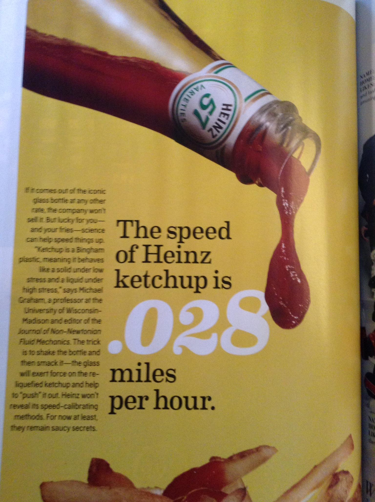

..  Copyright (C)  Mark Guzdial, Barbara Ericson, Briana Morrison
    Permission is granted to copy, distribute and/or modify this document
    under the terms of the GNU Free Documentation License, Version 1.3 or
    any later version published by the Free Software Foundation; with
    Invariant Sections being Forward, Prefaces, and Contributor List,
    no Front-Cover Texts, and no Back-Cover Texts.  A copy of the license
    is included in the section entitled "GNU Free Documentation License".

.. |runbutton| image:: Figures/run-button.png
    :height: 20px
    :align: top
    :alt: run button

.. |audiobutton| image:: Figures/start-audio-tour.png
    :height: 20px
    :align: top
    :alt: audio tour button

.. |codelensfirst| image:: Figures/codelens-first.png
    :height: 20px
    :align: top
    :alt: move to first button

.. |codelensback| image:: Figures/codelens-back.png
    :height: 20px
    :align: top
    :alt: back button

.. |codelensfwd| image:: Figures/codelens-forward.png
    :height: 20px
    :align: top
    :alt: forward (next) button

.. |codelenslast| image:: Figures/codelens-last.png
    :height: 20px
    :align: top
    :alt: move to last button

.. 	qnum::
	:start: 1
	:prefix: csp-3-6-

.. highlight:: java
   :linenothreshold: 4

Seguir al Ketchup Chorreando
====================================

Vamos a computar cuánto tardaría el ketchup en chorrear por una mesa.  Imagina que has inclinado una mesa de cuatro pies de alta, y derramado ketchup en la parte superior.  ¿Cuánto tardaría en llegar hasta la parte inferior?  Por esta vez vamos a ignorar la física y el ángulo de la mesa y simplemente empezaremos con una velocidad media del ketchup de .028 millas por hora.

    Figura 2: Velocidad de goteo del Ketchup

.. codelens:: Ketchup_Speed

   goteoMillasPorHora = .028
   PiesPorMilla = 5280.0
   goteoPiesPorHora = goteoMillasPorHora * PiesPorMilla
   MinPorHora = 60
   goteoPiesPorMin = goteoPiesPorHora / MinPorHora
   print("Velocidad del ketchup en pies por minuto:")
   print(goteoPiesPorMin)
   print("Tiempo para recorrer 4 pies en minutos:")
   print(4 / goteoPiesPorMin)

El siguiente tipo de problema es nuevo.  Muestra código correcto agrupado en bloques a la izquierda, pero el orden es incorrecto.  Tienes que arrastrar los bloques al lado derecho en el orden correcto.  Mira el vídeo a continuación para una demostración.

**Pulsa en la flecha hacia la derecha debajo para ver video siguiente.**

.. video:: parsons
   :controls:
   :thumb: ../_static/MixedUpCodeVideoThumb.png

   http://ice-web.cc.gatech.edu/ce21/1/static/video/MixedUpCode.mov
   http://ice-web.cc.gatech.edu/ce21/1/static/video/MixedUpCode.webm

.. parsonsprob:: 3_6_1_Ketchup_Speed

   El siguiente programa calcula la velocidad del ketchup en pies por <i>segundo</i>.  Arrastra los bloques de la izquierda y ponlos en el orden correcto en la derecha.  Pulsa el botón <i>Check Me</i> para comprobar tu solución.

   -----
   goteoMillasPorHora = .028
   PiesPorMilla = 5280.0
   goteoPiesPorHora = goteoMillasPorHora * PiesPorMilla
   =====
   MinPorHora = 60
   goteoPiesPorMin = goteoPiesPorHora / MinPorHora
   =====
   SegPorMin = 60
   goteoPiesPorSeg = goteoPiesPorMin / SegPorMin
   =====
   print("Velocidad del ketchup:")
   print(goteoPiesPorSeg)

.. note::

    Discute los temas tratados en esta sección con tus compañeros.

      .. disqus::
          :shortname: cslearn4u
          :identifier: studentcsp_3_6
