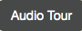

..  Copyright (C)  Mark Guzdial, Barbara Ericson, Briana Morrison
    Permission is granted to copy, distribute and/or modify this document
    under the terms of the GNU Free Documentation License, Version 1.3 or
    any later version published by the Free Software Foundation; with
    Invariant Sections being Forward, Prefaces, and Contributor List,
    no Front-Cover Texts, and no Back-Cover Texts.  A copy of the license
    is included in the section entitled "GNU Free Documentation License".

.. |runbutton| image:: Figures/run-button.png
    :height: 20px
    :align: top
    :alt: run button

.. 	qnum::
	:start: 1
	:prefix: csp-4-2-

Cadenas como Objetos
=====================

..	index::
	single: dot-notation
	single: notación punto
	pair: programming; dot-notation
	pair: programación; notación punto

Las cadenas son objetos en Python, lo que significa que hay un conjunto de funciones predefinidas que pueden usarse para manipular cadenas.  Puedes usar la **notación punto** para invocar las funciones sobre un objeto cadena, como en ``frase.lower()``.  La función ``lower()`` devuelve una nueva cadena con todos los caracteres de la cadena original en minúscula.  La función ``capitalize()`` devolverá una nueva cadena con la primera letra de la cadena en mayúscula.

.. activecode:: String_Methods2
   :tour_1: "Line-by-line Tour"; 1: str2-line1; 2: str2-line2; 3: str2-line3; 4: str2-line4; 5: str2-line5;
   :nocodelens:

   frase = "ESTO ES UNA PRUEBA"
   mejor = frase.lower()
   print(mejor)
   aunMejor = mejor.capitalize() + "."
   print(aunMejor)

Obtener Parte de una Cadena
---------------------------

..	index::
	single: index
	single: índice
	single: slice
	single: rodaja
	pair: string; slice
	pair: cadena; rodaja

Una cadena tiene caracteres en una secuencia.  Cada carácter está en una posición o **índice** que empieza en 0 como se muestra a continuación. Un **índice** es un número asociado con una posición en una colección de valores como una cadena.

    Figura 1: Una cadena con la posición (índice) mostrado sobre cada carácter

Una **rodaja** (*slice* en inglés) es una forma de obtener parte de una cadena.  Una forma de usar una **rodaja** es hacer ``nombreCadena[num]``.  Esto devolverá una nueva cadena con solo el carácter en esa posición de la cadena.

.. activecode:: String_Slice1
   :nocodelens:

   frase = "Esto es una prueba"
   s1 = frase[1]
   print(s1)
   s2 = frase[5]
   print(s2)
   s3 = frase[8]
   print(s3)
   s4 = frase[10]
   print(s4)

    Figura 2: Una cadena con la posición (índice) mostrado sobre cada carácter

Una **rodaja** con dos valores (comienzo y final) separados por un ``:`` entre ellos devuelve una nueva cadena con los caracteres desde la posición de comienzo dada hasta el carácter anterior a la posición final dada.

.. activecode:: String_Slice2
   :nocodelens:

   frase = "Esto es una prueba"
   s1 = frase[1:3]
   print(s1)
   s2 = frase[5:7]
   print(s2)
   s3 = frase[8:11]
   print(s3)
   s4 = frase[10:14]
   print(s4)

**Comprueba tu Comprensión**

.. mchoice:: 4_2_1_Slice
   :answer_a: Esto es el final
   :answer_b: Esto
   :answer_c: sto
   :correct: c
   :feedback_a: Sería cierto si estuviéramos imprimiendo el valor de str y no la hubiéramos cambiada en la línea 2.
   :feedback_b: Sería cierto si la primera posición fuera 1 y la subcadena incluyera el carácter de la posición final, pero el primer carácter de la cadena está en la posición 0 y la subcadena no incluirá el carácter de la posición final.
   :feedback_c: Devuelve una cadena que empieza en la posición 1 y termina en la posición 3.

   ¿Qué se imprimirá cuando se ejecute lo siguiente?

   ::

     str = "Esto es el final"
     str = str[1:4]
     print(str)

.. mchoice:: 4_2_2_Slice2
   :answer_a: e
   :answer_b: o
   :answer_c: es el final
   :correct: a
   :feedback_a: Imprimirá el carácter en la posición 5 de la cadena que es e.  Recuerda que el primer carácter está en lla posición 0.
   :feedback_b: Sería cierto si el primer carácter estuviera en la posición 1 en lugar de 0.
   :feedback_c: Sería cierto si devolveira desde la posición dada hasta el final de la cadena, pero no es eso lo que hace.

   ¿Qué se imprimirá cuando lo siguiente se ejecute?

   ::

     str = "Esto es el final"
     str = str[5]
     print(str)

Otras Funciones de Cadena
----------------------------

..	index::
	single: len
	pair: cadena; len
	pair: string; len

La función ``len(cadena)`` toma una cadena como entrada y retorna el número de caracteres en la cadena, incluyendo los espacios.

.. activecode:: String_Length
   :nocodelens:

   frase = "Esto es una prueba"
   longitud = len(frase)
   print(longitud)
   frase = "Hola"
   longitud = len(frase)
   print(longitud)

..	index::
	single: find
	pair: string; find
	pair: cadena; find

La función ``find(cadena)`` toma una cadena como entrada y retorna el índice donde se encuentra esa cadena en la cadena actual.  Si la cadena no se encuentra devuelve -1.

.. activecode:: String_Find
   :nocodelens:

   frase = "esto es una prueba"
   pos = frase.find("es")
   print(pos)
   pos = frase.find("love")
   print(pos)

.. note::
   La función ``find`` devolverá la primera posición en la que encuentra la cadena dada.  Date cuente que el código de arriba imprime 0 que significa que encuentra "es" en "esto" antes.

   **Comprueba tu entendimiento**

.. mchoice:: 4_2_3_stringLen
   :answer_a: 13
   :answer_b: 15
   :answer_c: 10
   :correct: b
   :feedback_a: No olvides incluir los espacios en la cuenta.
   :feedback_b: La función len devuelve el número de elementos de la cadena incluyendo espacios.
   :feedback_c: Sería cierto si la función len solo devolviera el número de caracteres alfabéticos, pero incluye todos, incluidos los espacios.

   Dado el siguiente fragmento de código, ¿qué se imprimirá?

   ::

     calle = "125 Main Street"
     print(len(calle))

.. mchoice:: 4_2_4_Find
   :answer_a: 4
   :answer_b: 21
   :answer_c: 22
   :correct: a
   :feedback_a: La función find devuelve la primera posición que contiene la cadena dada.
   :feedback_b: Sería cierto si fuera pos = str.find(" es").
   :feedback_c: Sería cierto si fuera pos = str.find(" es") y la primera posición fuera 1, pero es 0.

   ¿Qué se imprimirá cuando se ejecute lo siguiente?

   ::

     str = "Tienes una camisa que es roja"
     pos = str.find("es")
     print(pos)

.. tabbed:: 4_2_5_WSt

        .. tab:: Pregunta

           Escribe el código para evaluar la longitud de la cadena "Me gustan los huevos verdes" e imprímela.  Debería imprimir "La longitud es 17".

           .. activecode::  4_2_5_WSq
               :nocodelens:

        .. tab:: Respuesta

            Crea una variable para contener la cadena.

            .. activecode::  4_2_5_WSa
                :nocodelens:

                # DECLARA VARIABLES
                frase = 'Me gustan los huevos verdes'
                # IMPRIME RESULTADO
                print('La longitud es ' + str(len(frase)))

        .. tab:: Discusión

            .. disqus::
                :shortname: uclm-eii-cs
                :identifier: studentcsp_4_2_4_WSq

.. note::

    Discute los temas tratados en esta sección con tus compañeros.

      .. disqus::
          :shortname: uclm-eii-cs
          :identifier: studentcsp_4_2
