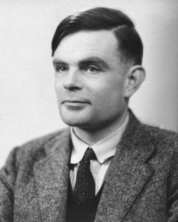

..  Copyright (C)  Mark Guzdial, Barbara Ericson, Briana Morrison
    Permission is granted to copy, distribute and/or modify this document
    under the terms of the GNU Free Documentation License, Version 1.3 or
    any later version published by the Free Software Foundation; with
    Invariant Sections being Forward, Prefaces, and Contributor List,
    no Front-Cover Texts, and no Back-Cover Texts.  A copy of the license
    is included in the section entitled "GNU Free Documentation License".

..  shortname:: Capítulo2: ¿Qué pueden hacer los computadores?
..  description:: Describe qué puede hacer un computador

.. setup for automatic question numbering.

.. 	qnum::
	:start: 1
	:prefix: csp-2-2-

Turing Machines
==================================

..	index::
	single: Turing, Alan
	single: Turing Machine
	single: Máquina de Turing

La idea de un computador fue descrita por primera vez en 1936, más de una docena de años antes que se construyera el primer computador electrónico.  `Alan Turing <http://en.wikipedia.org/wiki/Alan_Turing>`_, un brillante matemático, intentaba contestar una pregunta de interés para los matemáticos de principios del siglo 20, "¿Cuáles son los límites de las matemáticas?  ¿Qué puede ser computado usando matemáticas, y que verdades no pueden ser computadas?"  Turing definió un dispositivo (una `Máquina de Turing <http://en.wikipedia.org/wiki/Turing_machine>`_) que contestaba esa pregunta: *Cualquier cosa que sea posible computar matemáticamente podría ser programada en una Máquina de Turing.*

    Figura 2: Fotografía de Alan Turing

.. mchoice:: 2_2_1_Turing_Q1
		   :answer_a: Ocasionalmente corría 40 millas hasta Londres para asistir a una reunión.
		   :answer_b: Propuso el Test de Turing para decidir si un computador es o no inteligente.
		   :answer_c: Trabajó en romper las máquinas cifradoras Enigma durante la Segunda Guerra Mundial.
		   :answer_d: Fue al colegio en Oxford, Inglaterra.
		   :correct: d
		   :feedback_a: Es cierto.  Era un corredor con talento e incluso intentó clasificarse para las Olimpiadas.
		   :feedback_b: Es cierto.  Dijo que si un computador podía engañar a una persona haciéndole creer que es una persona, ese computador podría considerarse inteligente.
		   :feedback_c: Es cierto.  Winston Churchill dijo que Alan Turing hizo la mayor contribución individual para ganar la Segunda Guerra Mundial.
		   :feedback_d: Es falso.  Fue al King's College en Cambridge y a la Universidad de Princeton.

		   Usa el siguiente enlace para aprender más de `Alan Turing <http://en.wikipedia.org/wiki/Alan_Turing>`_.  (Nota del T. Si el inglés no es lo tuyo prueba la `versión en español <http://en.wikipedia.org/wiki/Alan_Turing>`_) ¿Cuál de las siguientes afirmaciones es **falsa** acerca de él?

Los computadores actuales funcionan de forma diferente a la máquina de Turing pero son matemáticamente equivalentes.  *Cualquier cosa que pueda ser computada puede ser programada en cualquier ordenador electrónico moderno.*  **TODOS** los computadores, desde los que se encuentran en tu microondas hasta los super-mega computadores que predicen el tiempo tienen las mismas capacidades básicas.  Pulsa en el siguiente enlace para aprender más acerca de `cómo funcionan las Máquinas de Turing. <http://www.storyofmathematics.com/20th_turing.html>`_.

.. figure:: Figures/turing_machine.gif
    :width: 300px
    :align: center
    :alt: Una Máquina de Turing
    :figclass: align-center

    Figura 3: Figura de una Máquina de Turing

El significado de esa frase es enorme.  Por ejemplo, significa que es *posible* ejecutar cualquier programa en cualquier ordenador, aunque podría significar que tienes que programar mucho para hacerlo funcionar.  Pero no significa que podamos resolver *todos* los problemas en cualquier computador.  Una de las cosas importantes que Turing demostró es que **algunos problemas no pueden ser resueltos por computadores, nunca**.

La Máquina de Turing realmente no sabía nada de números, lo que puede resultar sorprendente para un dispositivo que podía hacer cualquier cálculo matemático. En su lugar, simplemente podía hacer marcas en un trozo de cinta de papel, y posteriormente *contar* esas marcas para poder hacer matemáticas.  En la vida real los computadores electrónicos son igual de bobos.  *Cuentan* usando patrones de voltajes en los cables (e.g. "off,on,off,off" es una representación del número *4* en binario).  Pero realmente nosotros no queremos trabajar con patrones como éste, por lo que la gente ya ha programado operaciones matemáticas básicas en el computador.

..	index::
	single: abstraction
	single: abstracción

Cuando trabajas con un computador ya tienes todo tipo de capacidades añadidas por otros.  Tu computador ya sabe cómo tratar con números y operaciones matemáticas, y otro montón de cosas.  Sin embargo al nivel básico, incluso los supercomputadores más grandes, más potentes y más caros no pueden resolver problemas mejor que una Máquina de Turing. **Todos los ordenadores son exactamente iguales en términos de lo que pueden hacer.**

.. mchoice:: 2_2_2_Computers_Q1
		   :answer_a: Existieron los computadores femeninos.
		   :answer_b: Puedes hacer un computador con Tinkertoys.
		   :answer_c: Los computadores pueden resolver cualquier problema.
		   :answer_d: Los computadores usan secuencias de voltajes en los cables para representar números.
		   :correct: c
		   :feedback_a: Es cierto.  Busca información sobre los Computadores de Harvard y las Secret Rosies.
		   :feedback_b: Es cierto.  Unos estudiantes de MIT hicieron esto en los años 1980.
		   :feedback_c: Es falso.  Turing demostró que hay problemas que los computadores no pueden resolver.
		   :feedback_d: Es cierto.  Los computadores usan patrones de voltajes de encendido/apagado para representar números.

		   Which of the following is **false** about computers?

..	index::
	single: programming language
	single: lenguaje de programación
	pair: programming; languages
	pair: programación; lenguajes

Un **lenguaje de programación** (como *Java* o *Python*) que es un lenguaje que te permite decirle al ordenador lo que tiene que hacer, puede hacer cualquier cosa que pueda hacer una Máquina de Turing (ni más ni menos).  Una herramienta de programación como `Alice <http://www.alice.org>`_ o `Scratch <http://scratch.mit.edu>`_ pueden hacer *la mayoría* de loq que puede hacer una Máquina de Turing, pero típicamente no todo.  **Puedes programar cualquier cosa que pueda hacer una Máquina de Turing en Python.**

.. note::

    Discute los temas tratados en esta sección con tus compañeros.

      .. disqus::
          :shortname: uclm-eii-cs
          :identifier: studentcsp_2_2
