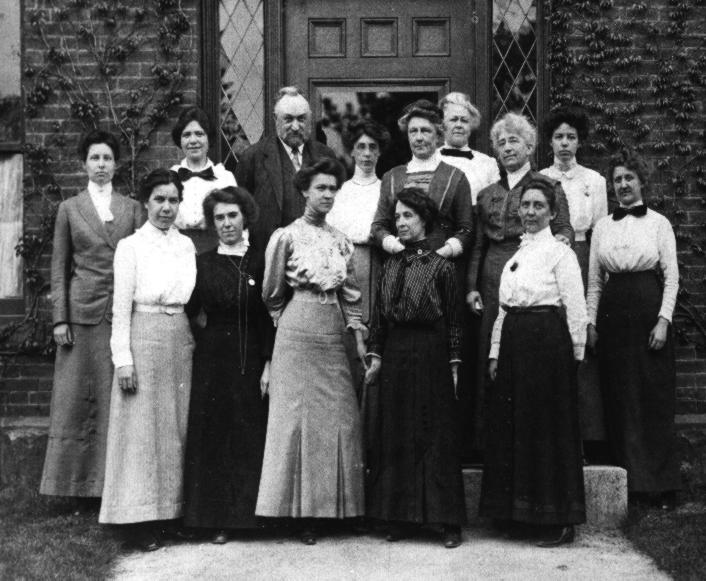

..  Copyright (C)  Mark Guzdial, Barbara Ericson, Briana Morrison
    Permission is granted to copy, distribute and/or modify this document
    under the terms of the GNU Free Documentation License, Version 1.3 or
    any later version published by the Free Software Foundation; with
    Invariant Sections being Forward, Prefaces, and Contributor List,
    no Front-Cover Texts, and no Back-Cover Texts.  A copy of the license
    is included in the section entitled "GNU Free Documentation License".

..  shortname:: Capítulo2: ¿Qué pueden hacer los computadores?
..  description:: Describe qué puede hacer un computador

.. setup for automatic question numbering.

.. 	qnum::
	:start: 1
	:prefix: csp-2-1-

¿Qué es un computador?
==================================

*Objectivos de Aprendizaje:*

- Entender que los computadores procesan datos.
- Entender que un programa es una secuencia de instrucciones para un computador.
- Entender lo que es una máquina de Turing y cómo se usa para deerminar lo que podemos o no podemos computar.
- Entender que los computadores no pueden resolver todos los problemas.
- Entender qué es un lenguaje de programación.

..	index::
	single: computer
	single: computador
	single: ordenador

..	index::
	single: program
	single: programa

Un **computador** es un dispositivo que puede realizar acciones sobre una entrada (también llamada datos).  Las acciones son especificadas por un **programa**, que es una secuencia de instrucciones.  Un computador no tiene por qué ser electrónico.  ¿Sabías que existieron los computadores femeninos? `las computadoras de Harvard <http://en.wikipedia.org/wiki/Harvard_Computers>`_ fueron contratadas para hacer cálculos astronómicos.  Computador era un trabajo, como camarero o doctor.

..	index::
	single: Harvard computers
	single: Computadoras de Harvard

    Figure 1: Las computadoras de Harvard de 1913

Los computadores actuales son electrónicos, pero es posible construir un computador con luz, o DNA, o incluso `TinkerToys <http://www.retrothing.com/2006/12/the_tinkertoy_c.html>`_.  Todos los computadores manipulan datos de acuerdo a unas instrucciones.
