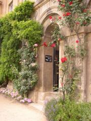

..  Copyright (C)  Mark Guzdial, Barbara Ericson, Briana Morrison
    Permission is granted to copy, distribute and/or modify this document
    under the terms of the GNU Free Documentation License, Version 1.3 or
    any later version published by the Free Software Foundation; with
    Invariant Sections being Forward, Prefaces, and Contributor List,
    no Front-Cover Texts, and no Back-Cover Texts.  A copy of the license
    is included in the section entitled "GNU Free Documentation License".

..  shortname:: Capítulo: Lo que puedes hacer con un computador
..  description:: Algunas pildoritas de lo que puedes hacer con un computador

.. setup for automatic question numbering.

.. 	qnum::
	:start: 1
	:prefix: csp-1-6-

.. |runbutton| image:: Figures/run-button.png
    :height: 20px
    :align: top
    :alt: run button

.. |audiobutton| image:: Figures/start-audio-tour.png
    :height: 20px
    :align: top
    :alt: audio tour button

Computar con Imágenes
=====================

..	index::
	single: images

..	index::
	single: pictures

..	index::
	single: pixels

Las imágenes en un computador están divididas en diminutos trocitos llamados **pixels**, de *picture* (pix) y *elements* (els).  Estos están distribuidos en una malla, de izquierda a derecha (la dimensión horizontal o **x**) y de arriba a abajo (la dimensión vertical o **y**).

.. figure:: Figures/grid.png
    :align: center
    :alt: Una malla con dimensiones horizontal (x) y vertical (y)
    :figclass: align-center

    Figura 4: Una malla con dimensiones horizontal (x) y vertical (y)

Los pixels son muy pequeños.  Incluso esta pequeña imagen tiene 180 columnad y 240 filas de pixels:

    Figura 5: Foto de un arco de Oxford, Inglaterra

.. mchoice:: 1_6_1_Image_Q1
   :answer_a: De izquierda a derecha
   :answer_b: De derecha a izquierda
   :answer_c: De arriba a abajo
   :answer_d: De abajo a arriba
   :correct: c
   :feedback_a: El valor de x se incrementa de izquierda a derecha
   :feedback_b: La dirección horizontal es la dirección x
   :feedback_c: El valor de y se incrementa de arriba a abajo
   :feedback_d: Esto es habitual en un sistema de coordenadas Cartesianas, pero no es cierto aquí

   ¿En qué sentido se icrementa y en una imagen?

Cada pixel tiene un color asociado con él: Una cantidad de rojo, una cantidad de verde, y una cantidad de azul.  La cantidad puede estar en el rango de 0 a 255 donde 0 es nada de ese color y 255 es la máxima cantidad de ese color.  Un pixel se muestra usando luz, no pintura, por lo que puede que funcione de forma ligeramente diferente a lo que tú esperas si solo tienes experiencia en hacer colores mezclando pintura.  Por ejemplo, tú mezclarías pintura azul y amarilla para hacer el verde, pero hay que mezclar luz roja y verde para hacer luz amarilla.  Consulta http://www.webexhibits.org/causesofcolor/1BE.html que proporciona un procedimiento para experimentar esto por tí mismo.

.. figure:: http://www.d.umn.edu/~mharvey/colorwheel.jpg
    :width: 200px
    :align: center
    :alt: una rueda de color para combinar luces de colores
    :figclass: align-center

    Figura 6: Cómo combinar luces para hacer colores

Todas las manipulaciones de imagen en Photoshop y todos los filtros de Instagram o Hipstamatic se crean manipulando estos componentes de color rojo, verde y azul de cada pixel.

Vamos a eliminar el rojo de esta imagen.  El programa a continuación lo hace.

..	index::
	single: comentario
	single: comment
	pair: programming; comment
	pair: programación; comentario

**Hay muchas líneas en el siguiente programa.  No te preocupes si no todas tienen sentido para tí todavía.**

  - Especialmente cuando escribimos programas para manipular imágenes, puedes ignorar muchas de las líneas.  Algunas incorporan una biblioteca que nos ayuda a trabajar con imágenes, como ``from image import *``.  Otras como ``win = ImageWin(img.getWidth(),img.getHeight())`` y ``img.draw(win)`` nos permiten ver el resultado.
  - Las palabras después de ``#`` son ignoradas por el computador.  Son **comentarios** para ayudar a los lectores humanos a entender el programa.

Las líneas importantes están bajo los comentarios (líneas que comienzan por un ``#``).  Pulsa el botón |audiobutton| para escuchar una explicación auditiva de las líneas importantes.  Pulsa el botón |runbutton| para ejecutar el programa y ver la imagen cambiada.  Ten en cuenta que el procesamiento de todos estos pixels puede llevar algunos minutos.

.. raw:: html

    

.. activecode:: Images_1
    :tour_1: "Important Lines Tour"; 3,6,10,14: timg1-line361014; 4: timg1-line4; 7: timg1-line7; 8: timg1-line8; 11: timg1-line11; 12: timg1-line12; 15-16: timg1-line15-16;
    :nocodelens:

    from image import *

    # Crea una imagen de un archivo
    img = Image("arch.jpg")

    # Itera todos los pixels
    pixels = img.getPixels()
    for p in pixels:

        # Quita el rojo
        p.setRed(0)
        img.updatePixel(p)

    # Mostrar la imagen cambiada
    win = ImageWin(img.getWidth(),img.getHeight())
    img.draw(win)

.. mchoice:: 1_6_2_Image_Black
   :answer_a: Aún ves la imagen, pero está toda ella en tonos de gris.
   :answer_b: La imagen está completamente blanca.
   :answer_c: La imagen está completamente negra.
   :correct: c
   :feedback_a: No si todos los valores de color son 0.
   :feedback_b: ¿Lo has probado? Esto solo sería cierto si pones todos los valores a 255 en lugar de 0.
   :feedback_c: Negro es la ausencia de luz. Poner todos los colores a 0 resulta en una imagen completamente negra, puesto que no hay luz.

   ¿Qué crees que pasa cuando pones todos los colores a 0?  Prueba a añadir ``p.setBlue(0)`` y ``p.setGreen(0)`` al programa anterior después de ``p.setRed(0)`` y ejecútalo para comprobarlo.

.. note::

    Discute los temas de esta sección con tus compañeros.

      .. disqus::
          :shortname: cslearn4u
          :identifier: studentcsp_1_6
